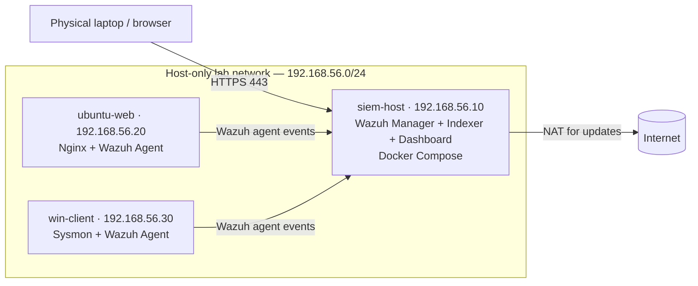

# Mini-SOC Week 1 — actual lab topology

```mermaid
flowchart LR
  H[Physical laptop / browser] -->|HTTPS 443| S
  subgraph N[Host-only lab network — 192.168.56.0/24]
    S[siem-host · 192.168.56.10\nWazuh Manager + Indexer + Dashboard\nDocker Compose]
    U[ubuntu-web · 192.168.56.20\nNginx + Wazuh Agent]
    W[win-client · 192.168.56.30\nSysmon + Wazuh Agent]
    U -->|Wazuh agent events| S
    W -->|Wazuh agent events| S
  end
  S -->|NAT for updates| I[(Internet)]
```

Only `siem-host` retains NAT. Endpoint VMs are on the host-only network after software installation.
